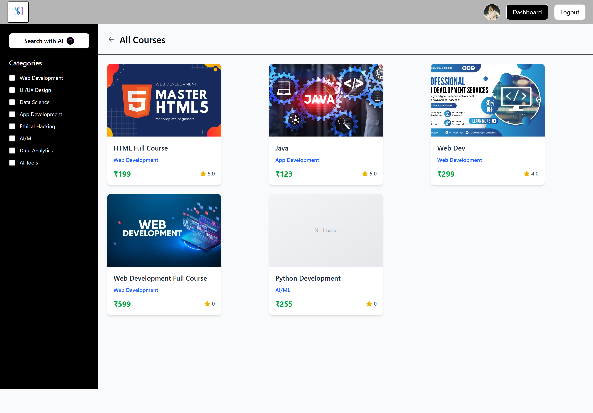

# 🎓 SkillHive – Full Stack LMS Platform

SkillHive is a **modern Learning Management System (LMS)** built using the **MERN Stack**.  
It allows users to explore courses, enroll, learn online, and manage their profiles with secure authentication.

🔗 **Live Demo:** https://skillhive-bksm.onrender.com/  
🔗 **GitHub Repo:** https://github.com/Arjun490209/SkillHive  

---

## 🚀 Features

### 👤 User Features
- 🔐 Secure Authentication (JWT)
- 🧑‍🎓 User Registration & Login
- 👤 Profile Update with Image Upload
- 🔍 Search Courses with AI Support
- ⭐ Course Reviews & Ratings
- 📚 Enroll & Learn Courses

### 👨‍🏫 Admin / Instructor Features
- ➕ Create & Manage Courses
- 📦 Upload Course Content
- 📊 Manage Users & Courses
- 🗑 Delete / Update Courses

---

## 🛠 Tech Stack

### Frontend
- React.js  
- Tailwind CSS  
- React Router  
- Axios  
- React Icons  

### Backend
- Node.js  
- Express.js  
- MongoDB  
- Mongoose  
- JWT Authentication  
- Cloudinary (Image Upload)  

### Deployment
- Frontend & Backend: **Render**
- Database: **MongoDB Atlas**

---

## 📸 Screenshots

### 🏠 Home Page


### 📚 Course Page


---

## ⚙️ Installation & Setup

### 1️⃣ Clone the Repository
```bash
git clone https://github.com/Arjun490209/SkillHive.git
cd SkillHive
